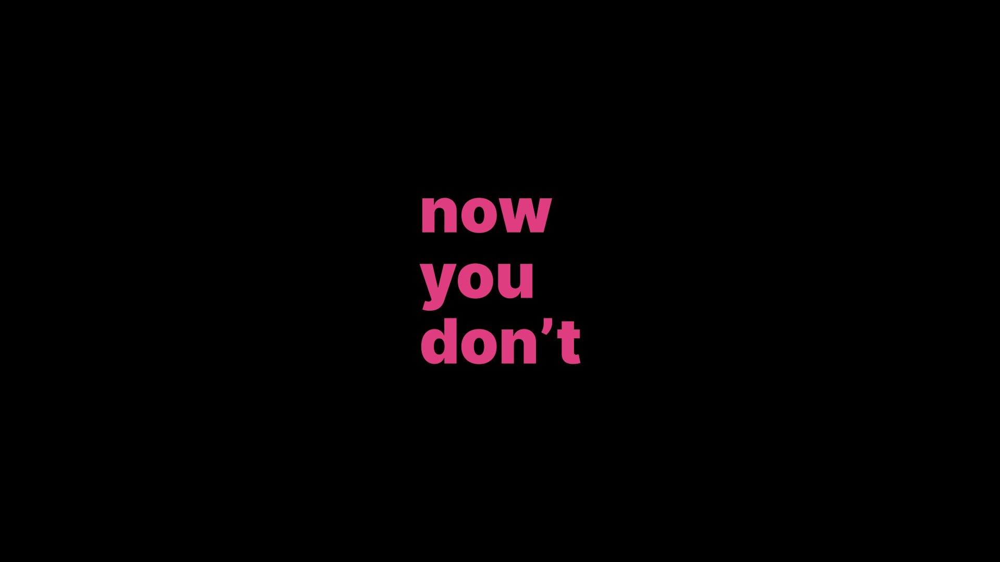

# Minimal Zoom backgrounds

Here are some Zoom backgrounds with text that hides behind your head when you’re looking at the camera, but reveals itself when you’re away.

**Note:** If you have the _Mirror my video_ option on, they’ll look inverted to you but okay to others.

## [Download ZIP](https://github.com/dar5hak/minimal-zoom-backgrounds/archive/main.zip)
